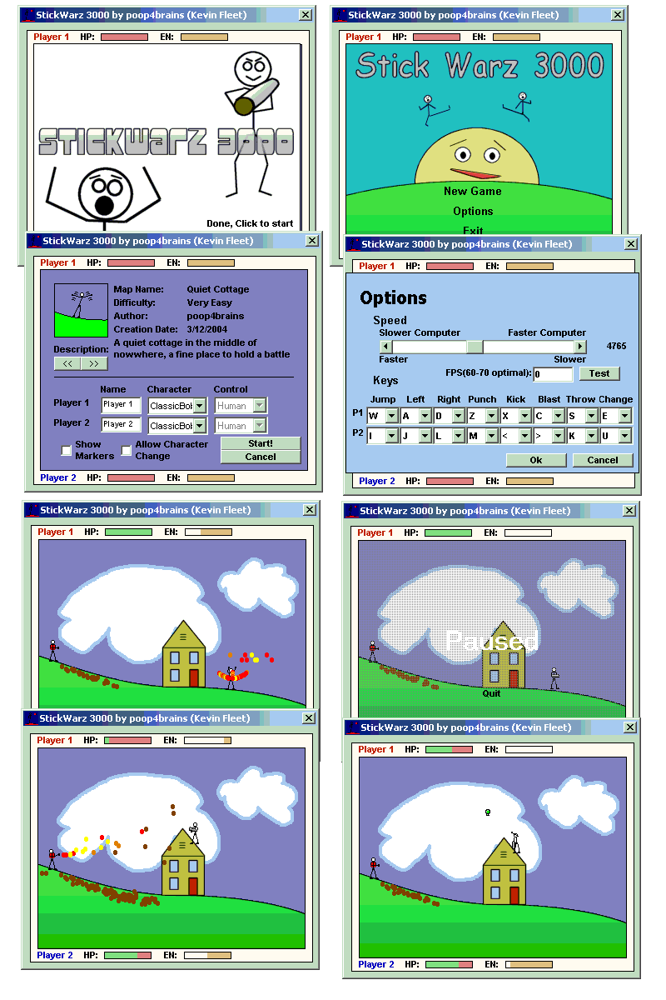



## Stickwarz 3000 v2 The ultimate stick figure fighting game \(NOW WITH GOOD AI\!\!\)

### Description

Now the only progress made from the last version was a half developed internet play system (hopefully better, need help with this people!), and ai... I must say though... the AI has made the game 200% better... I am no longer fighting my other hand, and i am actually losing some battles... For all of you who dont know what stickwarz is, its a stick figure fighting game with multiple levels and characters.... and hopefully in the near future (with the help of someone) internet play.... Plz Download and Play, and come back and tell me what you think!
 
### More Info
 

             |
---                |---
**Submitted On**   |2004-05-24 19:45:32
**By**             |[poop\_4\_brains](https://github.com/Planet-Source-Code/PSCIndex/blob/master/ByAuthor/poop-4-brains.md)
**Level**          |Intermediate
**User Rating**    |5.0 (25 globes from 5 users)
**Compatibility**  |VB 6\.0
**Category**       |[Games](https://github.com/Planet-Source-Code/PSCIndex/blob/master/ByCategory/games__1-38.md)
**World**          |[Visual Basic](https://github.com/Planet-Source-Code/PSCIndex/blob/master/ByWorld/visual-basic.md)
**Archive File**   |[Stickwarz\_1749805242004\.zip](https://github.com/Planet-Source-Code/poop-4-brains-stickwarz-3000-v2-the-ultimate-stick-figure-fighting-game-now-with-good-ai__1-54001/archive/master.zip)

